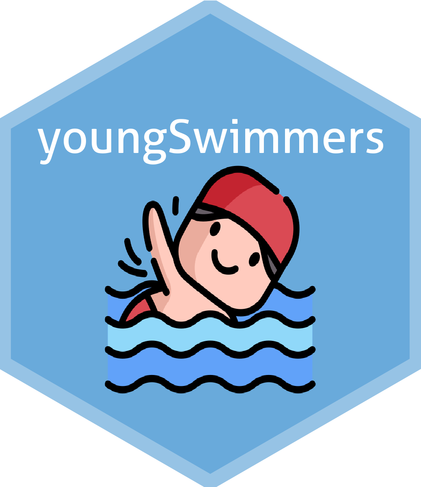

<!-- README.md is generated from README.Rmd. Please edit that file -->

#  youngSwimmers

<!-- badges: start -->

[](https://github.com/NIM-ACh/youngSwimmers/actions)
[](https://lifecycle.r-lib.org/articles/stages.html#stable)
[](https://CRAN.R-project.org/package=youngSwimmers)
<!-- badges: end -->

This is an `R` package that contains the data used for the young
swimmers [study](https://doi.org/10.3389/fphys.2021.769085), which aims
to be a complementary tool for research reproducibility and exploratory
data analysis.

## About <i class="fab fa-r-project"></i>

[`R`](https://www.r-project.org/about.html) is a high-level statistical
programming language used for data analysis, as well for development
creating software, websites, reports, applications, e-books, etc.

## Installation

You can install the latest development version of `youngSwimmers` from
[GitHub](https://github.com/) with:

``` r
# install.packages("devtools")
devtools::install_github("nim-ach/youngSwimmers")
```

## Example

This is a basic example which shows you how to access the dataset:

``` r
library(youngSwimmers) # Load the package

swimmers[, 1:6] # Print columns 1 to 6
#>      period subject    sex age weight height
#>   1:    t-0     s01   Male  13   66.0  166.0
#>   2:    t-0     s02   Male  16     NA  176.0
#>   3:    t-0     s03 Female  15   62.8  158.0
#>   4:    t-0     s05 Female  12   45.6  157.5
#>   5:    t-0     s06   Male  15   63.5  168.0
#>  ---                                        
#> 126:    t-4     s34 Female  14   62.4  158.5
#> 127:    t-4     s36   Male  12   51.5  164.0
#> 128:    t-4     s40 Female  13   50.0  159.0
#> 129:    t-4     s45   Male  13   50.9  164.0
#> 130:    t-4     s46 Female  14   69.3  159.0
```

For more examples on how to use the dataset, please visit the section
[“Using the `swimmers`
dataset”](https://nim-ach.github.io/youngSwimmers/articles/articles/using_data.html)
from our website. There you will find information for computing
descriptive statistics and plotting functionalities.

## Citation

To cite the dataset please use:

Castillo-Aguilar M, Valdés-Badilla P, Herrera-Valenzuela T, Guzmán-Muñoz
E, Delgado-Floody P, Andrade DC, Moraes MM, Arantes RME and
Núñez-Espinosa C. (2021). Cardiac Autonomic Modulation in Response to
Muscle Fatigue and Sex Differences During Consecutive Competition
Periods in Young Swimmers: A Longitudinal Study. Front. Physiol.
12:769085. doi: 10.3389/fphys.2021.769085

Or run from your `R` console:

``` r
citation("youngSwimmers")
#> 
#> To cite youngSwimmers in publications use:
#> 
#>   Castillo-Aguilar M, Valdés-Badilla P, Herrera-Valenzuela T,
#>   Guzmán-Muñoz E, Delgado-Floody P, Andrade DC, Moraes MM, Arantes RME
#>   and Núñez-Espinosa C. (2021). Cardiac Autonomic Modulation in
#>   Response to Muscle Fatigue and Sex Differences During Consecutive
#>   Competition Periods in Young Swimmers: A Longitudinal Study. Front.
#>   Physiol. 12:769085. doi: 10.3389/fphys.2021.769085
#> 
#> A BibTeX entry for LaTeX users is
#> 
#>   @Article{,
#>     title = {Cardiac Autonomic Modulation in Response to Muscle Fatigue and Sex Differences During Consecutive Competition Periods in Young Swimmers: A Longitudinal Study},
#>     author = {Matías Castillo-Aguilar and Pablo Valdés-Badilla and Tomás Herrera-Valenzuela and Eduardo Guzmán-Muñoz and Pedro Delgado-Floody and David Cristóbal Andrade and Michele M. Moraes and Rosa M. E. Arantes and Cristian Núñez-Espinosa},
#>     journal = {Frontiers in Physiology},
#>     year = {2021},
#>     volume = {12},
#>     pages = {1989},
#>     url = {https://www.frontiersin.org/articles/10.3389/fphys.2021.769085/full},
#>     doi = {10.3389/fphys.2021.769085},
#>     issn = {1664-042X},
#>   }
```
